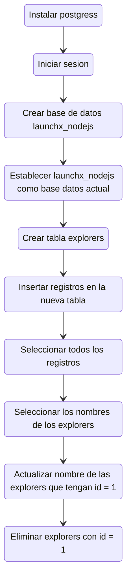

# SQL

Práctica de introducción a sql con Postgresql

Launch X Mission NodeJs

## Pasos

### Instalar Postgresql

El motor de base de datos de Postgresql se descarga desde el siguiente sitio oficial de [postgres](https://www.postgresql.org/download). Seleccioanar el binario correspondiente al sistema operativo y arquitectura que posees.

### Iniciar sesión

### Mostrar bases de datos disponibles

### Crear base de datos launchx_nodejs

### Seleccionar como base de datos de trabajo a la nueva base de datos creada

### Crear una nueva tabla explorers

### Agregar registros a la tabla explorers

### Seleccionar todos los registros

### Seleccionar los nombres de los explorers

### Actualizar el nombre de los exploeres cuando su id sea 1

### Eliminar los explorers con id igual a 1

## Resumen

